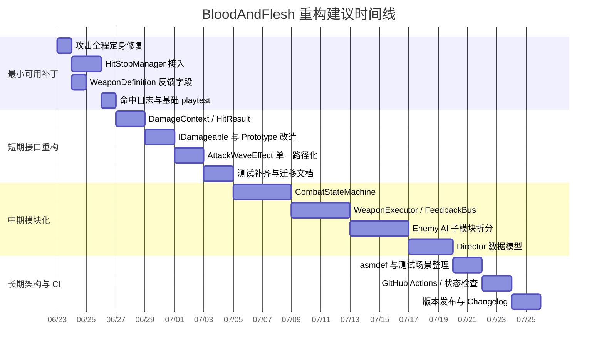
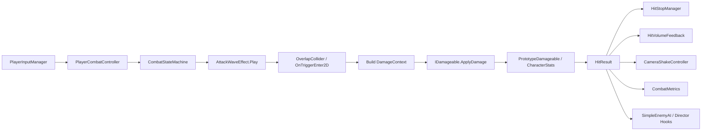

# BloodAndFlesh Unity2D 俯视角肉鸽重构与实现路线图

## 执行摘要

`BloodAndFlesh` 当前已经不是“从零开始”的仓库，而是一个已经具备原型骨架的 Unity 2022.3 项目：仓库包含 `PlayerCombatController`、`AttackWaveEffect`、`PlayerInputManager`、`SimpleEnemyAI`、`WorldHostilitySpawner`、`PlayerVisionMask`、`SafeRoomManager` 等核心脚本，此外 `Packages/manifest.json` 已经引入了 Input System 与 Unity Test Framework。也就是说，战斗、敌人、迷雾视野、安全屋与动态刷怪的“雏形”都已存在，问题不在于“有没有系统”，而在于这些系统还没有形成稳定、可扩展、可测试的契约层。citeturn3view6turn5view2turn5view3turn13view0turn19view0turn20view0

最紧迫的问题集中在战斗链路。当前 `PlayerCombatController.cs` 已达 1162 行、`AttackWaveEffect.cs` 达 1373 行、`SimpleEnemyAI.cs` 达 974 行；`IDamageable` 仍是单个 `void TakeDamage(...)`；`PlayerCombatController.AttackRoutine()` 在前摇后会把 `BlocksMovement` 直接恢复为 `false`；`AttackWaveEffect.DamageCollider()` 负责命中判定，但拿不到结构化的命中反馈结果；`PrototypeDamageable` 虽然会闪白、播放 `HitVolumeFeedback`、通知 AI 受击、死亡后 `SetActive(false)`，但整条链路没有统一的 `DamageContext / HitResult / FeedbackPayload` 数据面。结果就是：能打中，但很难做出稳定的命中停滞、攻击承诺感、击退、镜头反馈与以后更复杂的敌我交互。citeturn14view0turn14view1turn14view2turn11view1turn23view1turn17view4turn15view1turn12view2

因此，本报告给出的核心建议是：**不要先大拆 AI、Director、Hub；先用一个低风险、可回滚的战斗主线重构，把“打击手感”和“数据契约”做实，再把 AI、Director、迷雾和 Hub 挂到同一条可扩展事件总线上。** 推荐路线分四阶段推进：先做最小可用补丁，把命中停滞、全程攻击定身、击退与命中结果打通；再做短期接口重构；随后做中期模块化；最后补齐长期架构治理、自动化测试与 CI。这样既能尽快改善可玩性，也不会把未来功能扩展锁死在大脚本里。citeturn11view1turn17view4turn24view0turn24view1turn19view0turn7search2turn9search9

下表给出建议的主路径。

| 阶段 | 目标 | 理想投入 | 主要收益 | 主要风险 | 回滚方式 |
|---|---|---:|---|---|---|
| 最小可用补丁 | 命中停滞、攻击全程定身、统一击退参数、镜头/体积反馈接线 | 3–5 人日 | 立即提升“打中”的重量感 | `timeScale` 方案可能影响协程与刷怪计时 | 功能开关；武器字段回退为 0 |
| 短期接口重构 | 引入 `DamageContext` / `HitResult` / 新 `IDamageable` | 6–9 人日 | 打通命中结果、暴击、格挡、受击反应 | 接口破坏性变更 | 兼容适配层与独立分支保留旧接口 |
| 中期模块化 | Combat State Machine、反馈总线、AI/Director 模块边界 | 10–15 人日 | 可扩展到新武器、新 AI、新关卡规则 | 大文件拆分带来行为漂移 | 先并行新旧实现，场景对照测试后切换 |
| 长期架构与 CI | asmdef、PlayMode/EditMode 测试、GitHub Actions、版本化发布 | 6–10 人日 | 可持续迭代、减少回归、提高协作质量 | CI 易脆弱、维护成本上升 | 先做非阻塞检查，再逐步设为必过 |

这些投入估算基于仓库现状：战斗、AI、迷雾、安全屋都已经存在，因此不是从头开发；同时由于核心逻辑集中在少量大脚本中，重构的主要成本是“拆边界并保行为”，而不是新造完全陌生的系统。citeturn14view0turn14view1turn14view2turn5view2turn11view6turn13view0

## 现状诊断

当前战斗层最明显的结构性症结，是“系统存在，但契约缺位”。`PlayerCombatController` 的内部状态机只有 `Ready`、`PrimaryAttack`、`SpecialAction` 三态，`BlocksMovement` 与 `LocksFacing` 只是近似行为开关，而不是显式的攻击阶段模型；同时 `TryAttack()`、`TrySpecialAttack()`、多个武器分支、技能逻辑、护盾、位移、视觉表现和输入排队都被塞进同一大类里。这种结构在原型阶段很快，但一旦你要加入硬直、取消窗、受击打断、格挡、后续连段或不同武器的窗口曲线，就会非常快地出现条件分支爆炸。citeturn23view0turn23view1turn23view3turn23view4turn14view0

更直接的问题是，当前“攻击承诺感”并没有真正落地。`AttackRoutine()` 在开始时调用 `BeginCombatAction(..., true)`，意味着攻击本来是会阻挡移动的；但在前摇 `windup` 结束后，会立刻执行 `BlocksMovement = false`，导致有效帧和后摇阶段玩家又能立刻恢复移动。这和你要的“攻击期间绝对不能移动”相冲突，也会直接削弱近战的风险回报关系。citeturn11view1turn23view1turn5view0

命中链路也存在双轨问题。当前真正用于波形命中检测的是 `AttackWaveEffect`：它会在 `Play/PlayAttached` 中设置 `activeWeapon`，通过 `waveCollider.OverlapCollider(...)` 找到重叠敌人，并在 `DamageCollider()` 中调用 `IDamageable.TakeDamage(...)`，随后根据武器类型发射不同粒子。与此同时，`PlayerCombatController` 里还保留了一个 `ResolveHit()`，它用 `Physics2D.OverlapCircleAll(...)` 再做一套直接伤害，但在当前主攻击流程里真正被调用的是 `PlayAttackWave(...)`。这说明项目处于“旧命中路径未清理，新的视觉/碰撞路径已上线”的过渡期。这样的双轨设计极易在以后造成重复判定、手感不一致和调参困难。citeturn17view2turn17view3turn17view4turn17view5turn18view0turn7search3

`IDamageable` 的接口过薄，是命中反馈无法做厚的根源之一。当前接口只有 `void TakeDamage(float amount, float armorPiercing = 0f, Vector2 hitSource = default, CharacterStats attacker = null);`，它既不返回“这次命中是否被接受”，也不返回“最终伤害是多少、是否暴击、是否死亡、是否被格挡、应用了什么受击反应”。然而 `CharacterStats.ApplyDamage(...)` 实际上已经能返回最终伤害数值，而 `DamageCalculator` 也已经能计算暴击与护甲减伤。这意味着数据并不是完全没有，只是没有被抬升为统一的外部契约。citeturn15view1turn6view0turn6view1

受击反馈目前是“局部存在、全局不统一”。`PrototypeDamageable` 会做受击染色、调用 `HitVolumeFeedback.Play(...)`、通知 `SimpleEnemyAI.OnDamaged(...)`，并在死亡时 `SetActive(false)`；`HitVolumeFeedback` 自身也已经支持缩放与粒子喷发；敌人 AI 的 `OnDamaged(...)` 会根据 `hitSource` 与 `force` 做击退和哨兵告警；玩家侧则有 `PlayerInputManager.ApplyExternalKnockback(...)` 的独立实现。也就是说，项目已经有玩家击退、敌人击退、体积压缩反馈与一定程度的警觉行为，但它们分别隐藏在不同脚本中，没有共享统一的命中反馈负载。citeturn12view2turn2view9turn24view1turn24view0

从系统层看，未来扩展的“支点”其实已经在仓库里。`PlayerVisionMask` 使用相机、射线数量、渐隐半径等参数组织视野遮罩；`SafeRoomManager` 负责进入/退出安全屋；`WorldHostilitySpawner` 已经有 `spawnInterval`、`maxStageEnemies`、按配置生成多种敌人原型的能力；`Packages/manifest.json` 里已经引入 `com.unity.inputsystem` 和 `com.unity.test-framework`。这意味着你不需要推倒重做 AI、迷雾与关卡循环，只需要给它们接上更稳的战斗与事件基座。citeturn11view5turn12view6turn12view7turn13view0turn19view0

仓库治理层面则明显滞后于功能原型。主分支根目录提交了 `Library`、`Logs`、`UserSettings`、`.csproj`、`.sln` 等 Unity/IDE 生成内容，而 `.gitignore` 目前只有 `/.agents` 和 `/.vscode` 两行；我也没有在仓库中找到 `Assets/Tests` 或 `.github/workflows` 目录。这种状态对单人原型影响不大，但一旦进入多人协作、回归测试和版本发布阶段，就会大幅增加噪声与冲突。citeturn3view7turn3view8turn25view0turn25view1

## 目标与成功标准

这次重构不应该只写成“代码更优雅”，而需要明确到**可测量的手感和可持续的架构指标**。由于当前项目已经采用 Unity Input System、使用 `FixedUpdate` 进行移动与物理控制、并广泛使用 `WaitForSeconds` / `Time.deltaTime` 协程驱动战斗，因此成功标准必须同时覆盖“游戏时间”与“真实时间”两个维度。`Time.timeScale`、`Time.deltaTime`、`Time.fixedDeltaTime`、`WaitForSeconds`、`WaitForSecondsRealtime` 在时间尺度变化时的行为不同；如果你的手感需求不量化，命中停滞、击退与攻击窗口就会在不同机型和不同帧率下产生主观漂移。citeturn8search2turn8search10turn8search13turn7search0turn7search16turn26search1turn26search2

建议采用下表作为重构成功标准。

| 维度 | 成功标准 | 测量方式 |
|---|---|---|
| 攻击承诺感 | 100% 的主攻击在 `windup + active + recovery` 全时段阻断移动；只有明确允许的技能例外 | PlayMode 自动化断言 `BlocksMovement` 与 `PlayerInputManager` 的速度输出 |
| 命中停滞 | 95% 以上的成功命中触发配置化 hit stop；实测时长误差控制在 ±8ms 内 | 记录 `HitStopManager.Request` 时间戳与恢复时间的 `unscaled` 差值 |
| 命中注册 | 同一 `attackId + targetId` 只能生效一次；自动化场景中命中漏判率 < 1% | 记录碰撞候选、命中接受、最终伤害三类计数 |
| 受击反应 | 近战/法术/刺击至少区分 3 类反馈曲线；击退与闪白、粒子、相机震动由同一 payload 驱动 | 通过 `HitResult` 与 `FeedbackPayload` 采样日志验证 |
| 可扩展性 | 新增武器或敌人时，不需要修改 monolith 中超过 2 个核心脚本 | PR Diff 统计与代码评审准则 |
| 回归安全 | 每次合并前必须通过 EditMode + PlayMode 烟雾测试 | GitHub required status checks |

这些目标之所以合理，是因为当前仓库已经具备战斗脚本、敌人脚本、测试框架依赖和迷雾/关卡/安全屋原型；你并不是在追求“从无到有的可玩”，而是在追求“将原型行为固化为可验证的系统契约”。citeturn19view0turn14view0turn14view1turn14view2turn5view2turn11view6

## 分阶段路线图

### 里程碑与优先级

建议的总体优先级是：**先战斗核心，再事件契约，再模块化，再 CI/治理。** 原因很简单：你想要的卖点首先是“硬核战斗手感”和“高压迫感生存”，而这些并不会因为先做更复杂的 Director 或 Hub 而自动成立；相反，如果攻击承诺感、命中停滞与击退反馈还不成立，后续系统只会把现在的脆弱手感放大。当前仓库中的 `WorldHostilitySpawner` 还是一个 124 行的定时刷怪器，而真正的压力系统还没有进化成带状态感知的 Director，因此最优策略是先让“打中”和“被打中”的主循环可信，再让 AI/Director 在这套契约上变复杂。citeturn13view0turn14view0turn14view1turn14view2

| 阶段 | 范围 | 理想投入 | 关键产出 | 风险 | 回滚策略 |
|---|---|---:|---|---|---|
| 最小可用补丁 | 只改战斗主链路，不拆文件边界 | 3–5 人日 | hit stop、全程攻击锁、统一击退字段、事件日志、基础相机震动 | `timeScale` 影响刷怪计时与协程等待 | `UseHitStop` / `UseCombatLockV2` 功能开关；武器字段调 0 即失效 |
| 短期接口重构 | 改接口，不大拆系统 | 6–9 人日 | `DamageContext`、`HitResult`、新 `IDamageable`、兼容 `PrototypeDamageable` | 编译破坏性变更 | 保留 `legacy-damage-interface` 分支；适配层过渡一版 |
| 中期模块化 | 拆 monolith，建立状态机和反馈总线 | 10–15 人日 | `CombatStateMachine`、`WeaponExecutor`、`FeedbackBus`、`IAgentKnockbackReceiver`、Director 状态模型 | 行为漂移、合并冲突 | 并行保留旧 `PlayerCombatController`，用场景 A/B 对照验证 |
| 长期架构与 CI | 治理、测试、发布 | 6–10 人日 | asmdef、测试场景、GitHub Actions、PR 模板、版本发布规则 | CI 维护成本上升 | 前两周仅做非阻塞检查，成熟后再设为必过 |

### 命中停滞方案比较

当前代码大量依赖 `WaitForSeconds`、`Time.deltaTime` 和 `FixedUpdate`。Unity 文档说明：`WaitForSeconds` 使用缩放时间；`deltaTime` 随 `timeScale` 变化；`fixedDeltaTime` 与 `FixedUpdate` 同样受 `timeScale` 影响；当 `timeScale = 0` 时，`FixedUpdate` 不会继续调用。因此，选择哪种 hit stop 方案，不是审美问题，而是会直接决定你要不要重写大量协程与移动逻辑。citeturn16view0turn16view3turn24view0turn26search1turn26search2turn26search9turn7search0turn7search16

| 方案 | 做法 | 优点 | 缺点 | 适合阶段 | 结论 |
|---|---|---|---|---|---|
| 同步式全局 hit stop | `HitStopManager` 统一改 `Time.timeScale`，并用 `WaitForSecondsRealtime` / `unscaledDeltaTime` 负责恢复 | 接入最少；会同时冻结物理、击退、移动，冲击感最直接 | 会短暂影响所有依赖缩放时间的系统，如刷怪协程与位移协程 | MVP | **推荐作为第一阶段** |
| 异步式局部 hit stop | 只冻结攻击者/受击者/视觉层，世界其他系统继续跑 | 更精确；Boss、网络、投射物可单独豁免 | 需要把现有大量 `WaitForSeconds` / `deltaTime` 流程改为自定义时钟 | 中后期 | 作为长期升级方向 |
| 混合式 | 轻量全局停滞 + 个别系统用白名单豁免 | 效果与控制力折中 | 设计复杂度高 | 中期 | 当 Director/联动特技变多后再考虑 |

### 反馈数据归属方案比较

`WeaponDefinition` 现在是标准 `ScriptableObject`，并且已有 `CreateAssetMenu`；Unity 官方也明确推荐用 `ScriptableObject` 承载共享数据。因此，命中反馈参数不应该继续散落在 `PlayerCombatController`、`AttackWaveEffect`、`HitVolumeFeedback`、AI 中，而应该让武器数据和共享反馈配置形成一个可复用的调参层。citeturn15view0turn7search1turn7search5turn7search9

| 方案 | 优点 | 缺点 | 建议 |
|---|---|---|---|
| 全放在 `WeaponDefinition` | 改动最小；调参直观；适合当前仓库体量 | 字段容易越堆越多；跨武器共享曲线困难 | 适合 MVP |
| 全局统一反馈配置 | 一致性高；方便做默认值 | 武器个性不足；会把差异性挤回代码 | 不推荐单独使用 |
| `WeaponDefinition` + `CombatFeedbackProfile` 混合 | 共享默认值 + 局部覆盖，扩展性最好 | 比纯字段方案多一层资源管理 | **推荐从短期重构开始采用** |

### 时间线建议



这条时间线刻意把 CI 放在后段，不是因为它不重要，而是因为当前仓库连 `.gitignore`、测试目录和 `.github/workflows` 都还没有打底；过早把未稳定的工作流设成强约束，反而会增加摩擦。更合理的顺序是先让可测试对象稳定，再让 CI 固化它。citeturn3view8turn25view0turn25view1turn9search3turn9search9

## 代码级重构与 API 契约

### 最小可用补丁应该怎么落

**第一刀必须修 `PlayerCombatController.AttackRoutine()`。** 当前逻辑在 `windup` 之后就 `BlocksMovement = false`，这直接破坏了攻击承诺感。最小补丁应删除这一行，让 `BeginCombatAction(..., true)` 设置的移动锁一直持续到 `EndCombatAction()`。如果你希望个别技能例外，比如剑冲刺或法盾，那也应该把“是否允许位移”定义为技能能力，而不是让普通主攻击在中途偷偷释放移动。citeturn11view1turn23view1turn23view4

**第二刀应该落在 `WeaponDefinition.cs`。** 该文件目前只有 25 行，字段覆盖了伤害、破甲、范围、冷却、前摇、后摇、挥角、突刺距离、扫掠布尔值和目标层，但还没有 hit stop、击退、受击反应、相机震动等手感参数。因为 `WeaponDefinition` 本身已经是 `ScriptableObject`，最符合当前工程的做法是先把手感参数保存在武器资源里，而不是散在控制器和效果脚本中。citeturn15view0turn7search1turn7search5

推荐先增加以下字段：

```csharp
[Header("Combat Feel")]
[Range(0f, 0.15f)] public float hitStopDuration = 0.045f;
[Range(0f, 0.15f)] public float hitStopTimeScale = 0f;
[Min(0f)] public float knockbackDistance = 0.8f;
[Min(0.01f)] public float knockbackDuration = 0.08f;
[Range(0f, 2f)] public float feedbackIntensity = 1f;
[Range(0f, 2f)] public float cameraShakeAmplitude = 0.25f;
```

**第三刀应该落在 `AttackWaveEffect.DamageCollider()`。** 现在这里已经是命中检测的主入口：它会从 `waveCollider.OverlapCollider(...)` 得到碰撞目标，调用 `IDamageable.TakeDamage(...)`，记录 `damagedColliders`，再决定放哪种命中粒子。因此 MVP 不需要去改多个入口，只要在这里成功命中后申请 hit stop、发射统一反馈事件，并将武器的击退参数传下去即可。相较于继续保留 `PlayerCombatController.ResolveHit()` 这样的另一套伤害路径，单源命中更容易调试，也更容易做自动化统计。Unity 文档也说明 `OverlapCollider` 适合频繁碰撞查询。citeturn17view3turn17view4turn17view5turn18view0turn7search3

### 建议采用的最终数据契约

短期重构后，我建议把命中和受击数据收敛到两个只读结构体：`DamageContext` 与 `HitResult`。`DamageContext` 从攻击侧生成，描述“发生了什么”；`HitResult` 从受击侧返回，描述“这次命中被如何处理”。这比现在的 `void TakeDamage(...)` 强太多，因为 hit stop、击退、相机、屏幕特效、浮字、AI 警觉、统计采样，都需要“处理结果”，而不是只知道“我叫过扣血函数”。这一设计也能直接接住 `CharacterStats.ApplyDamage(...)` 与 `DamageCalculator.Calculate(...)` 现有的最终伤害/暴击逻辑。citeturn15view1turn6view0turn6view1

建议契约如下：

```csharp
public readonly struct DamageContext
{
    public readonly int attackId;
    public readonly GameObject instigator;
    public readonly CharacterStats attackerStats;
    public readonly WeaponType weaponType;

    public readonly Vector2 origin;
    public readonly Vector2 hitPoint;
    public readonly Vector2 hitDirection;

    public readonly float baseDamage;
    public readonly float armorPiercing;

    public readonly float knockbackDistance;
    public readonly float knockbackDuration;

    public readonly float hitStopDuration;
    public readonly float hitStopTimeScale;

    public readonly float feedbackIntensity;
    public readonly bool canCrit;

    public DamageContext(
        int attackId,
        GameObject instigator,
        CharacterStats attackerStats,
        WeaponType weaponType,
        Vector2 origin,
        Vector2 hitPoint,
        Vector2 hitDirection,
        float baseDamage,
        float armorPiercing,
        float knockbackDistance,
        float knockbackDuration,
        float hitStopDuration,
        float hitStopTimeScale,
        float feedbackIntensity,
        bool canCrit = true)
    {
        this.attackId = attackId;
        this.instigator = instigator;
        this.attackerStats = attackerStats;
        this.weaponType = weaponType;
        this.origin = origin;
        this.hitPoint = hitPoint;
        this.hitDirection = hitDirection;
        this.baseDamage = baseDamage;
        this.armorPiercing = armorPiercing;
        this.knockbackDistance = knockbackDistance;
        this.knockbackDuration = knockbackDuration;
        this.hitStopDuration = hitStopDuration;
        this.hitStopTimeScale = hitStopTimeScale;
        this.feedbackIntensity = feedbackIntensity;
        this.canCrit = canCrit;
    }
}

public readonly struct HitResult
{
    public readonly bool accepted;
    public readonly bool dealtDamage;
    public readonly bool killed;
    public readonly bool critical;
    public readonly float finalDamage;
    public readonly float appliedKnockbackDistance;
    public readonly float appliedKnockbackDuration;

    public HitResult(
        bool accepted,
        bool dealtDamage,
        bool killed,
        bool critical,
        float finalDamage,
        float appliedKnockbackDistance,
        float appliedKnockbackDuration)
    {
        this.accepted = accepted;
        this.dealtDamage = dealtDamage;
        this.killed = killed;
        this.critical = critical;
        this.finalDamage = finalDamage;
        this.appliedKnockbackDistance = appliedKnockbackDistance;
        this.appliedKnockbackDuration = appliedKnockbackDuration;
    }

    public static HitResult Rejected => new(false, false, false, false, 0f, 0f, 0f);
}
```

对应的 `IDamageable` 建议直接升级为：

```csharp
public interface IDamageable
{
    HitResult ApplyDamage(in DamageContext context);
}
```

如果你希望降低短期迁移风险，可以在一个过渡版本里额外保留旧方法的适配器，但从最终架构看，`IDamageable` 不应继续停留在 `void`。仓库里当前真正的实现者是 `PrototypeDamageable`，范围是可控的。citeturn15view1turn14view4

### 推荐的新管理器与接口

为了避免继续在控制器和受击者身上硬连手感逻辑，建议增加以下契约层：

```csharp
public interface IHitStopService
{
    bool IsActive { get; }
    float RemainingUnscaledSeconds { get; }
    void Request(float duration, float timeScale = 0f, int priority = 0);
}

public interface IKnockbackReceiver
{
    void ApplyKnockback(Vector2 hitSource, float distance, float duration);
}

public interface ICombatStateMachine
{
    CombatPhase CurrentPhase { get; }
    bool IsBusy { get; }
    bool CanStart(in AttackCommand command);
    CombatExecutionHandle Begin(in AttackCommand command);
    void Interrupt(CombatInterruptReason reason);
    event Action<CombatWindowEvent> OnWindowOpened;
    event Action<CombatPhaseChanged> OnPhaseChanged;
}
```

`HitStopManager` 的 MVP 实现应使用 `WaitForSecondsRealtime` 或 `Time.unscaledDeltaTime` 来保证恢复逻辑不受 `timeScale` 影响；如果你用全局 `timeScale` 方案，Unity 文档建议同时处理 `Time.fixedDeltaTime`，否则 `FixedUpdate` 密度和物理表现会发生意外漂移。考虑到 `PlayerInputManager`、玩家位移协程、剑冲刺、矛突进、刷怪协程都依赖缩放时间，这个管理器必须把“恢复时间”牢牢绑定在真实时间上。citeturn24view0turn18view0turn16view3turn7search16turn26search1turn26search2turn26search9

### 对现有文件的具体补丁建议

#### `PlayerCombatController.cs`

这里不建议一步到位全拆，但应按以下顺序改。首先，删掉 `AttackRoutine()` 中 `BlocksMovement = false;` 这行。其次，把内部 `CombatActionState` 从三态升级为至少包含 `Windup / Active / Recovery / Special / Stunned / Interrupted` 的显式阶段枚举，哪怕第一版只是内部使用。第三，删除或废弃 `ResolveHit()`，让 `AttackWaveEffect` 成为唯一命中判定入口。第四，把每次攻击都生成一个 `attackId`，并随 `DamageContext` 往下传，这样才能在自动化测试中追踪重复命中。citeturn11view1turn23view0turn18view0

建议引入以下桥接：

```csharp
private int nextAttackId = 1;

private AttackCommand BuildPrimaryAttackCommand(WeaponDefinition weapon, Vector2 dir)
{
    return new AttackCommand(
        attackId: nextAttackId++,
        weapon: weapon,
        direction: dir,
        canMoveDuringAction: false,
        windup: GetSyncedWindupTime(weapon),
        active: GetSyncedActiveTime(weapon),
        recovery: GetSyncedRecoveryTime(weapon));
}
```

#### `AttackWaveEffect.cs`

这是第一优先级的“命中中心”。`DamageCollider()` 里应从“直接调用 `TakeDamage`”改为“构建 `DamageContext` -> 调用 `ApplyDamage` -> 根据 `HitResult` 统一派发反馈”。同时，`damagedColliders` 依旧可保留，但最好升级为“`attackId + targetCollider` 的幂等保护”，避免未来一个攻击对象在 attached / trigger / overlap 多路径下重复结算。当前 `DamageCollider()` 已经根据武器类型发射不同粒子；下一步只需要将这些视觉反馈与 hit stop、相机震动收束到同一逻辑分支即可。citeturn17view4turn17view5turn14view1

推荐骨架：

```csharp
private bool DamageCollider(Collider2D hit, WeaponDefinition weapon)
{
    if (hit == null || damagedColliders.Contains(hit))
        return false;

    foreach (MonoBehaviour behaviour in hit.GetComponents<MonoBehaviour>())
    {
        if (behaviour is not IDamageable damageable)
            continue;

        if (attackerStats == null)
            attackerStats = GetComponentInParent<CharacterStats>();

        Vector2 hitPoint = GetHitPoint(hit);
        Vector2 hitDir = ((Vector2)hit.transform.position - (Vector2)transform.position).normalized;

        DamageContext context = new DamageContext(
            attackId: currentAttackId,
            instigator: gameObject,
            attackerStats: attackerStats,
            weaponType: weapon.weaponType,
            origin: transform.position,
            hitPoint: hitPoint,
            hitDirection: hitDir,
            baseDamage: weapon.damage * GetAttachedHitDamageMultiplier(hit, weapon),
            armorPiercing: weapon.armorPiercing,
            knockbackDistance: weapon.knockbackDistance,
            knockbackDuration: weapon.knockbackDuration,
            hitStopDuration: weapon.hitStopDuration,
            hitStopTimeScale: weapon.hitStopTimeScale,
            feedbackIntensity: weapon.feedbackIntensity);

        HitResult result = damageable.ApplyDamage(in context);
        if (!result.accepted)
            return false;

        damagedColliders.Add(hit);

        if (result.dealtDamage)
            HitStopManager.Instance.Request(context.hitStopDuration, context.hitStopTimeScale);

        EmitHitVfx(hitPoint, weapon, result);
        CombatMetrics.RecordHit(context, result);
        return true;
    }

    return false;
}
```

#### `WeaponDefinition.cs`

从现在的“纯数值武器定义”升级到“带可调手感的武器定义”。第一阶段先把 hit stop、击退、反馈强度放在这里；第二阶段再加 `CombatFeedbackProfile` 引用，把通用曲线移出。当前文件非常小，是最适合先下沉数据的地方。citeturn15view0turn7search1

#### `IDamageable.cs`

这是破坏性最小、收益很大的接口升级点。当前文件只有 6 行，很适合作为契约升级的突破口；而且仓库中现阶段真正的命中对象主要还是 `PrototypeDamageable`。建议直接切换到 `HitResult ApplyDamage(in DamageContext context)`。citeturn15view1turn14view4

#### `PrototypeDamageable.cs`

建议把当前逻辑从“扣血 + 染色 + 播反馈 + 调 AI”改成“消费 `DamageContext`，产出 `HitResult`”。你已经有 `CharacterStats.ApplyDamage(...)` 的最终伤害返回值，也已经有 `HitVolumeFeedback` 与 `SimpleEnemyAI.OnDamaged(...)`，因此这里只需要做三件事：第一，依据 `currentHealth` 和 `finalDamage` 形成 `HitResult`；第二，把命中点/方向/强度从 `DamageContext` 传给 `HitVolumeFeedback` 与击退接收器；第三，死亡时由统一的死亡回调触发，而不是以后继续直接 `SetActive(false)`。第一阶段可以先保留 `SetActive(false)`，但中期最好改成 `OnDeath` 事件。citeturn12view2turn6view0turn24view1

#### `HitVolumeFeedback.cs`

保留现有 `Play(Vector2 hitSource)` 与 `Play(Vector2 hitSource, float intensity)` 兼容重载，但新增：

```csharp
public readonly struct HitFeedbackRequest
{
    public readonly Vector2 hitSource;
    public readonly float intensity;
    public readonly bool critical;
    public readonly WeaponType weaponType;
}

public void Play(in HitFeedbackRequest request);
```

这样未来暴击、盾反、法术命中、Boss 受击都可以在不改 `PrototypeDamageable` 逻辑分支的前提下扩展视觉反馈。当前脚本已经有缩放与粒子基础，升级成本很低。citeturn2view9turn14view3

### 推荐的事件流

下面这张图反映了建议的主链路。它的目标不是“更抽象”，而是让每个逻辑层只负责一件事：输入和状态机决定何时攻击；`AttackWaveEffect` 负责命中检测；受击者决定命中结果；反馈系统根据命中结果表现；指标系统负责记录。这样才便于以后挂迷雾告警、Director 敌意、撤离计分和 Hub 养成。citeturn23view1turn17view4turn12view2turn13view0turn11view6



## 测试与度量体系

当前项目已经安装了 `com.unity.test-framework` 1.1.33，这意味着你完全可以立即建立 EditMode 与 PlayMode 双层测试，而不需要先额外引入外部框架。Unity 官方文档指出，Unity Test Framework 既支持 Edit Mode，也支持 Play Mode；其中 Play Mode 测试可以通过 `UnityTest` 以协程方式运行，非常适合验证命中停滞、协程窗口、位移/击退和场景级系统行为。citeturn19view0turn7search2turn7search18

建议把测试分成三层。第一层是**纯逻辑单元测试**，运行在 EditMode：验证 `DamageCalculator`、`DamageContext` 默认值、`HitResult` 合法性、`CombatStateMachine` 的阶段转换、`HitStopManager` 的优先级并发处理。这一层追求快和确定性，不依赖场景。当前 `DamageCalculator` 与 `CharacterStats.ApplyDamage(...)` 已经是很好的切入点，因为它们本身就接近纯逻辑。citeturn6view1turn6view0turn7search2

第二层是**战斗场景 PlayMode 测试**。建议新建至少三个测试场景：`CombatSandbox`、`HitStopLab`、`EnemyReactionLab`。在 `CombatSandbox` 中验证：主攻击是否全程锁移动、命中后的 `HitResult.accepted` 与伤害数值是否一致、同一 `attackId` 是否只结算一次；在 `HitStopLab` 中记录命中触发到恢复的 `unscaled` 时长；在 `EnemyReactionLab` 中验证不同武器的击退距离/时长是否符合武器数据。由于当前玩家移动依赖 `FixedUpdate` 与 `playerRb.velocity`，而敌人击退也依赖协程与物理更新，所以这类测试必须在 PlayMode 做。citeturn24view0turn24view1turn8search2turn8search13

第三层是**自动化场景回归测试**，它应该模拟“真实玩 30 秒”。这类测试不是为了覆盖所有内容，而是为了防止你在拆 `PlayerCombatController`、`AttackWaveEffect`、`SimpleEnemyAI` 时把最核心的玩法打坏。推荐做两个烟雾场景：一个只放玩家、木桩、三类武器；另一个放玩家、迷雾、敌人、一个安全屋入口和刷怪器。当前仓库已有 `PlayerVisionMask`、`SafeRoomManager` 与 `WorldHostilitySpawner`，所以构建这种场景并不需要从零搭。citeturn11view5turn11view6turn13view0

建议采集以下指标，并把它们作为 PR 的自动输出工件：

| 指标 | 定义 | 目标 |
|---|---|---|
| 命中注册率 | `accepted hits / overlap candidates` | ≥ 99% |
| 重复命中率 | 同一 `attackId + targetId` 重复结算次数 / 总命中数 | 0 |
| hit stop 误差 | 实测 `unscaled` 时长 - 设定时长 | ±8ms 内 |
| 输入到命中反馈延迟 | 攻击输入时间到 `HitStopManager.Request` / `HitVolumeFeedback.Play` 的时间差 | 主武器 120ms 内 |
| 攻击锁一致性 | 攻击窗口内玩家速度重置失败的帧占比 | 0 |
| 性能烟雾 | 一轮测试中 GC 分配峰值与最大帧时间 | 作对比基线，不要求一开始绝对最优 |

之所以要用 `unscaled` 时钟来测，是因为 Unity 文档明确指出：`deltaTime` 与 `WaitForSeconds` 都受 `timeScale` 影响，而 `unscaledDeltaTime` / `WaitForSecondsRealtime` 则不受影响；如果你拿缩放时间去测命中停滞，就会把“效果本身”当成“计量误差”。citeturn8search10turn8search13turn7search0turn7search16

## 仓库治理与工作流

仓库治理现在需要一次性补底。主分支根目录已经提交了 `Library`、`Logs`、`UserSettings`、`.csproj`、`.sln` 等 Unity 自动生成内容，而 `.gitignore` 只有两行；与此同时，`.github/workflows` 与 `Assets/Tests` 目录都不存在。对原型来说这可以忍受，但对你要进入的“有计划地做阶段性重构与回归验证”的状态来说，这已经是实打实的阻力。citeturn3view7turn3view8turn25view0turn25view1

建议先做一轮**仓库清洁 PR**。把 `.gitignore` 替换为 Unity 官方/社区常用模板的等价内容，至少忽略 `Library/`, `Logs/`, `Temp/`, `Obj/`, `UserSettings/`, `.vs/`, `*.csproj`, `*.sln`。随后执行一次缓存清理提交，把这些已追踪的生成物从 Git 索引中拿掉。这样做的价值不只是“仓库更干净”，更直接的收益是：后续你拆文件、加 asmdef、跑测试时，PR 不会被无关文件淹没。当前仓库已经公开在 GitHub，后续协作与 code review 都会明显受益。citeturn3view7turn3view8turn9search24

分支策略建议采用很轻量的 trunk-based 变体：`main` 始终可运行；短生命周期功能分支以 `feat/`, `refactor/`, `fix/`, `test/`, `chore/` 命名；每个里程碑只允许一个主分支进行中的战斗重构；所有接口级变更必须先落一份迁移文档。这套策略不需要复杂 Git Flow，但必须辅以 GitHub 的分支保护和状态检查。GitHub 文档说明，受保护分支可以要求通过状态检查和批准评审后才能合并，而 required status checks 可以阻止未通过验证的提交直接进主干。citeturn9search0turn9search3turn9search9turn9search24

建议立刻配置以下规则：

| 项目 | 建议 |
|---|---|
| 保护分支 | `main` 启用 branch protection |
| 必需状态检查 | `editmode-tests`, `playmode-smoke`, `lint-or-compile` |
| 必需评审 | 至少 1 个批准评审；接口与架构 PR 至少 1 次 owner 自审清单 |
| PR 模板 | 包含“影响模块、回滚方式、测试结果、录屏/动图、是否修改契约” |
| Issue 模板 | `bug`, `combat-feel`, `architecture`, `content` 四类 |
| 合并方式 | squash merge，避免大量中间提交污染历史 |

GitHub 官方支持 issue/PR 模板，并支持把通过的状态检查设为合并前置条件；对你这种正在从单人原型过渡到系统化开发的项目，这些工具的边际收益很高。citeturn9search2turn9search5turn9search8turn9search11turn9search12

版本化建议从 **`0.1.0`** 开始，使用语义化版本。因为当前项目的“公开 API”并不是面向外部 SDK，而是面向你自己的资源、场景和脚本依赖关系；一旦你把 `IDamageable`、`DamageContext`、`CombatStateMachine` 等契约写进文档，它们就已经是项目内部的公共 API。SemVer 规范强调，采用语义化版本的软件应声明公共 API，版本号采用 `MAJOR.MINOR.PATCH`；GitHub Releases 也支持生成发布说明。citeturn10search0turn10search2turn10search3turn10search5turn10search8

推荐版本节奏如下：

| 版本 | 含义 |
|---|---|
| `0.1.0` | MVP 战斗补丁：hit stop、全程定身、击退字段、基础测试 |
| `0.2.0` | 短期接口重构：`DamageContext`、`HitResult`、新 `IDamageable` |
| `0.3.0` | 中期模块化：Combat State Machine、Feedback Bus、基础 Director |
| `0.4.0` | 架构治理：asmdef、CI、发布流程、示例场景与迁移文档 |

同时，建议采用 `CHANGELOG.md` + GitHub Releases 双轨。前者服务开发者日常阅读，后者服务里程碑归档与外部展示。对这个仓库来说，这一点比“发包自动化”更重要，因为你当前最大的风险不是构建，而是重构过程中“一次改了太多，最后不知道坏在哪里”。citeturn10search2turn10search8turn10search11

## 交付物与里程碑验收

为了防止路线图沦为抽象目标，每个阶段都应该有明确交付物，而且最好既包括代码，也包括“可运行证明”。当前仓库还没有测试目录和 CI 工作流，因此交付物的形式尤其重要：如果没有样例场景、测试脚本和迁移文档，你很难判断重构到底是在“进步”还是在“换一种方式搅乱现有原型”。citeturn25view0turn25view1turn19view0

建议每个里程碑交付如下。

| 里程碑 | 必交代码 | 必交场景/测试 | 必交文档 | 验收标准 |
|---|---|---|---|---|
| 最小可用补丁 | `HitStopManager.cs`、`WeaponDefinition` 字段补丁、`AttackWaveEffect` 命中补丁、`PlayerCombatController` 锁移动补丁 | `CombatSandbox`、`HitStopLab`、最少 5 个 PlayMode 测试 | `docs/combat-mvp.md` | 主武器命中有停滞；攻击全程不能移动；测试通过 |
| 短期接口重构 | `DamageContext.cs`、`HitResult.cs`、新 `IDamageable.cs`、`PrototypeDamageable` 重构 | `DamageContractTests`、`EnemyReactionLab` | `docs/damage-contract.md`、迁移说明 | 旧直连伤害路径删除/废弃；命中结果可追踪 |
| 中期模块化 | `CombatStateMachine.cs`、`WeaponExecutor.cs`、`CombatFeedbackProfile.asset`、`CombatMetrics.cs` | `CombatParityScene`、AI 基准场景 | `docs/combat-architecture.md` | 新旧实现同场景行为误差可接受 |
| 长期架构与 CI | asmdef、`.github/workflows/*`、PR 模板、Changelog、Release 模板 | CI 跑 EditMode + PlayMode smoke | `CONTRIBUTING.md`、`RELEASE.md` | `main` 合并必须通过检查 |

如果必须只给一个最短落地优先级，我的建议是：**先做阶段一的主链路补丁，再马上接阶段二的数据契约。** 原因是阶段一解决“玩起来像不像那么回事”，阶段二解决“以后还能不能一直迭代下去”；两者都比先做更复杂 AI、Director 或 Hub 更优先。当前仓库已经展示出未来要承载的系统范围——迷雾、安全屋、刷怪、敌人原型、输入、战斗、反馈——如果不尽快建立战斗契约层，后面的任何新功能都会继续把 `PlayerCombatController` 和 `AttackWaveEffect` 推向更难维护的方向。citeturn14view0turn14view1turn14view2turn11view5turn11view6turn13view0

最终结论可以压缩成一句话：**把 `AttackWaveEffect` 定成唯一命中中心，把 `IDamageable` 升级为“返回命中结果”的接口，把 `WeaponDefinition` 升级为“可调手感的数据源”，把 `PlayerCombatController` 从“大而全控制器”逐步改造成“输入门面 + 状态机驱动器”。** 只要这四件事做成，命中停滞、攻击承诺感、击退、AI 反应、Director 敌意、迷雾推演和 Hub 成长就都能站在同一套稳定底座上继续扩展。citeturn15view0turn15view1turn17view4turn23view1